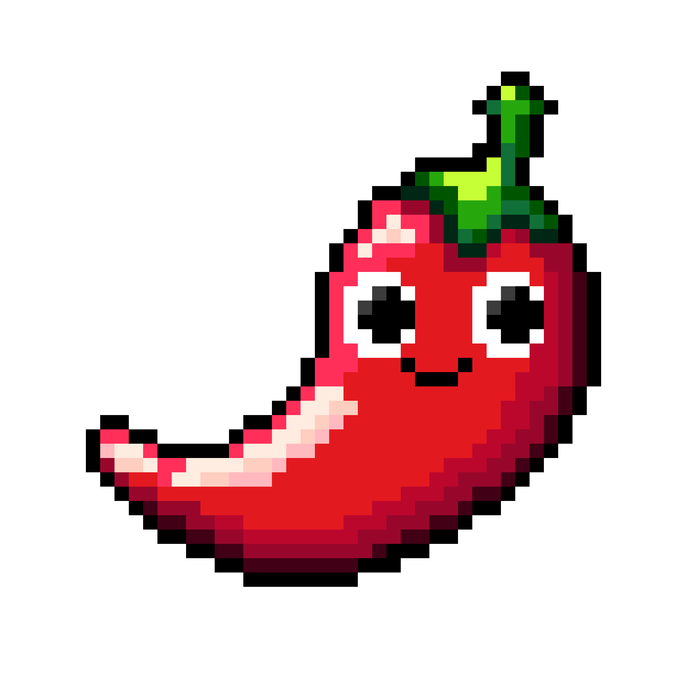

<h1 align="center">

</h1>

<h1 align="center">
   <b>🌶️<br />FlavorLang</b>
   <br />
   <i>"Cook 'n' Code"</i>
</h1>

<p align="center">
FlavorLang blends coding with culinary creativity! Write programs like recipes &mdash; add ingredients, cook, and serve ideas with unique keywords that make coding as fun and flavorful as your imagination.
</p>

<br />

---

> [!IMPORTANT]
> FlavorLang is currently in **Beta**. While core functionality is largely stable, new features, syntax, and language designs are subject to change without prior notice.
>
> Please feel free to contribute by reporting any issues or suggestions in the repository's [Issues](https://github.com/KennyOliver/FlavorLang/issues/).

---

## 📖 Table of Contents

### `README.md`

1. **[🌶️ Why FlavorLang?](#why-flavorlang)**

2. **[⚡ Quick Start](#quick-start)**

3. **[🚀 Terminal Flags &amp; Behaviors](#terminal-flags--behaviors)**

4. **[🎨 Install Syntax Highlighter Extension](#extension)**

### `docs/`

5. **[📚 Tutorial](docs/tutorial.md)**

6. **[📦 Standard Library](docs/standard_library.md)**

7. **[🔌 Creating & Using Plugins](docs/plugins.md)**

8. **[🧠 Brainf Interpreter](docs/brainf_interpreter.md)**

9. **[🐞 Debugging](docs/debugging.md)**

10. **[🛠️ Language Design](docs/language_design.md)**

11. **[🔤 Lexer](docs/lexer.md)**

12. **[📜 Parser](docs/parser.md)**

13. **[🌀 Interpreter](docs/interpreter.md)**

14. **[🌟 Resources &amp; Inspirations](docs/resources.md)**

---

## 🌶️ Why FlavorLang? <a id="why-flavorlang"></a>

- **Unique & Fun**: Express your programs like recipes!
- **Flexible Execution**: File extensions and flags allow customized program behavior.
- **Readable Syntax**: Keywords like add, mix, cook, and deliver make code approachable and enjoyable.
- **Debug-Friendly**: Easily trace and test your code step-by-step with `--debug` mode.

---

## ⚡ Quick Start <a id="quick-start"></a>

**Get up and running with FlavorLang in just a few steps!**

### 1. Install the Compiler

#### For macOS Users

##### 1. Download & Extract the ZIP

**[Latest FlavorLang Release](https://github.com/KennyOliver/FlavorLang/releases/latest)**

##### 2. Run the Install Script

<!-- chmod +x install.sh -->

```bash
$ bash install.sh
```

##### 3. Handle macOS Security Prompt (If Any)

- If macOS prompts a security warning, navigate to <kbd>System Preferences</kbd> > <kbd>Security & Privacy</kbd> > <kbd>General</kbd>.
- Click <kbd>Open Anyway</kbd> for `flavor`.

##### 4. Verify Installation

```bash
$ flavor --about
```

#### For Ubuntu Users

##### 1. Download & Extract the ZIP

**[Latest FlavorLang Release](https://github.com/KennyOliver/FlavorLang/releases/latest)**

##### 2. Run the Install Script

<!-- chmod +x install.sh -->

```bash
$ bash install.sh
```

##### 3. Verify Installation

```bash
$ flavor --about
```

#### Make it Yourself

```bash
$ git clone https://github.com/KennyOliver/FlavorLang.git
$ cd src
$ make
```

> [!Warning]
>
> Unless you move `flavor` to `/usr/local/bin/`,
> you'll have to use `./flavor` for commands with relative file paths.

### 2. Write Your First Recipe

```py
# recipe.flv

serve("Welcome to FlavorLang!");
```

### 3. Run the Program

```
$ flavor recipe.flv

Welcome to FlavorLang!
```

### 4. Debug Your Code

Enable debug mode to inspect tokens and execution flow.

```bash
$ flavor recipe.flv --debug
```

This will print detailed information about the tokenization and parsing process.

---

## 🚀 Terminal Flags & Behaviors <a id="terminal-flags--behaviors"></a>

```bash
$ flavor recipe.flv            # Run a FlavorLang script
$ flavor recipe.flv --debug    # Debug mode (verbose output)
$ flavor recipe.flv --minify   # Minify the script (creates recipe.min.flv)
$ flavor --about               # Show information about FlavorLang
$ flavor --github              # Open the GitHub repository
```

> [!Note]
>
> The `--debug` flag is really useful for understanding how FlavorLang is executing (tokenizing, parsing, and interpreting) your file.

---

## 🎨 Install the VS Code Syntax Highlighter <a id="extension"></a>

### Installation Instructions

#### 1. Download & Extract the ZIP ([FlavorLang Releases](https://github.com/KennyOliver/FlavorLang/releases))

#### 2. Open VS Code and Navigate to the Extensions Tab

#### 3. Click the <kbd>...</kbd> Menu and Select <kbd>Install from VSIX...</kbd>

#### 4. Restart your Extensions via the Popup Notification

### Make it Yourself

#### 1. Build the Extension

Navigate to the `vscode-extension` folder and install dependencies:

```bash
$ cd vscode-extension
$ npm install
```

#### 2. Package the Extension

Use `vsce` (Visual Studio Code Extension Manager) to build the `.vsix` package:

```bash
$ npx vsce package
```

#### 3. Install in VS Code

- Open VS Code.
- Press <kbd>&#8984;</kbd><kbd>&#8679;</kbd><kbd>P</kbd> (<kbd>Ctrl</kbd><kbd>Shift</kbd><kbd>P</kbd> on Windows) and select <kbd>Extensions: Install from VSIX…</kbd>.
- Select the generated `.vsix` file within the `vscode-extension` folder.
- Restart your extensions via the popup notification.

---

## License

This project is licensed under the Apache 2.0 License &mdash; see the [LICENSE](./LICENSE) file for details.

&copy; 2024-2025 Kenneth Oliver. All rights reserved.
