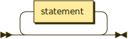
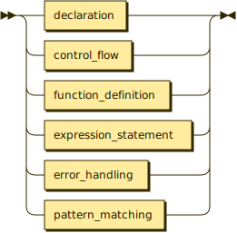
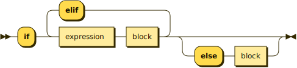
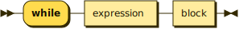
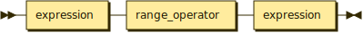
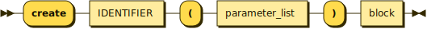
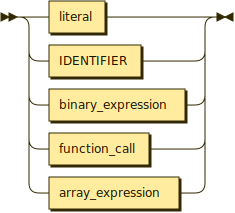
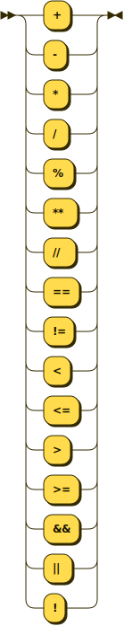

# FlavorLang Language Design Specification

## Overview

FlavorLang is a programming language designed with a cooking-inspired syntax, combining intuitive keywords with robust programming concepts. This document specifies the language's design, syntax, and grammar.

---

## 📖 Table of Contents

1. [Language Design Principles](#language-design-principles)
2. [Core Language Elements](#core-language-elements)
   - [1. Keywords](#1-keywords)
   - [2. Data Types](#2-data-types)
   - [3. Operators](#3-operators)
   - [4. Array Operations](#4-array-operations)
3. [Grammar Specification](#grammar-specification)
   - [Extended Backus-Naur Form (EBNF)](#extended-backus-naur-form-ebnf)
4. [License](#license)

---

## Language Design Principles

1. **Intuitive Syntax**: Culinary-inspired keywords make the language approachable
2. **Clear Semantics**: Each construct has unambiguous meaning
3. **Predictable Behavior**: Operations produce consistent results
4. **Strong Type System**: Type safety without excessive verbosity
5. **Error Handling**: Comprehensive error management capabilities

## Core Language Elements

### 1. Keywords

| Category                 | Keyword   | Description                    | Example                     |
| ------------------------ | --------- | ------------------------------ | --------------------------- |
| **Variable Declaration** | `let`     | Mutable variable declaration   | `let x = 5;`                |
|                          | `const`   | Immutable constant declaration | `const PI = 3.14;`          |
| **Control Flow**         | `if`      | Conditional execution          | `if condition { ... }`      |
|                          | `elif`    | Alternative condition          | `elif condition { ... }`    |
|                          | `else`    | Default condition              | `else { ... }`              |
|                          | `for`     | Loop iteration                 | `for i in range { ... }`    |
|                          | `while`   | Conditional loop               | `while condition { ... }`   |
|                          | `break`   | Exit loop or switch            | `break;`                    |
| **Pattern Matching**     | `check`   | Pattern matching construct     | `check value { ... }`       |
|                          | `is`      | Pattern case                   | `is pattern:`               |
| **Functions**            | `create`  | Function declaration           | `create func() { ... }`     |
|                          | `deliver` | Return value                   | `deliver result;`           |
| **Error Handling**       | `try`     | Exception handling             | `try { ... }`               |
|                          | `rescue`  | Error catching                 | `rescue { ... }`            |
|                          | `finish`  | Cleanup block                  | `finish { ... }`            |
|                          | `burn`    | Raise error                    | `burn "Error message";`     |
| **I/O Operations**       | `serve`   | Output                         | `serve("message");`         |
|                          | `sample`  | Input                          | `let input = sample();`     |
|                          | `plate`   | File write                     | `plate_file(path, data);`   |
|                          | `garnish` | File append                    | `garnish_file(path, data);` |
|                          | `taste`   | File read                      | `taste_file(path);`         |

### 2. Data Types

| Type      | Description        | Internal Representation | Range/Precision    |
| --------- | ------------------ | ----------------------- | ------------------ |
| `integer` | Whole numbers      | 64-bit signed           | ±9.2e18            |
| `float`   | Decimal numbers    | 64/128-bit              | ±1.7e±308 (64-bit) |
| `string`  | Text sequence      | UTF-8                   | Memory limited     |
| `boolean` | Truth values       | 1 byte                  | `True`/`False`     |
| `array`   | Ordered collection | Dynamic                 | Memory limited     |

### 3. Operators

| Category   | Operators                           | Associativity |
| ---------- | ----------------------------------- | ------------- |
| Arithmetic | `+`, `-`, `*`, `/`, `**`, `//`, `%` | Left to right |
| Comparison | `==`, `!=`, `<`, `<=`, `>`, `>=`    | Left to right |
| Logical    | `&&`, `\|\|`                        | Left to right |
| Range      | `..`, `..=`                         | Left to right |
| Assignment | `=`                                 | Right to left |

### 4. Array Operations

| Operation    | Syntax             | Description            |
| ------------ | ------------------ | ---------------------- |
| Access       | `array[index]`     | Get element at index   |
| Append       | `array[^+]`        | Add to end             |
| Prepend      | `array[+^]`        | Add to start           |
| Remove Last  | `array[^-]`        | Remove from end        |
| Remove First | `array[-^]`        | Remove from start      |
| Slice        | `array[start:end]` | Get subset             |
| Reverse      | `array[::-1]`      | Reverse elements       |
| Step Slice   | `array[::step]`    | Get elements with step |

## Grammar Specification

### Extended Backus-Naur Form (EBNF)

<details>

<summary>
<b>EBNF Code</b>
</summary>

<br>

```ebnf
program ::= statement*

statement ::= declaration
            | control_flow
            | function_definition
            | expression_statement
            | error_handling

declaration ::= variable_declaration
              | constant_declaration

IDENTIFIER ::= [a-zA-Z_][a-zA-Z0-9_]*

variable_declaration ::= "let" IDENTIFIER "=" expression ";"
constant_declaration ::= "const" IDENTIFIER "=" expression ";"

control_flow ::= if_statement
               | loop_statement
               | switch_statement

if_statement ::= "if" expression block
               ( "elif" expression block )*
               ( "else" block )?

loop_statement ::= while_loop | for_loop

while_loop ::= "while" expression block

for_loop ::= "for" IDENTIFIER "in" range block

range ::= expression range_operator expression

range_operator ::= ".." | "..="

function_definition ::= "create" IDENTIFIER "(" parameter_list ")" block

parameter_list ::= ( IDENTIFIER ( "," IDENTIFIER )* )?

block ::= "{" statement* "}"

expression_statement ::= expression ";"

expression ::= literal
             | IDENTIFIER
             | binary_expression
             | function_call
             | array_expression

literal ::= NUMBER | STRING | BOOLEAN

binary_expression ::= expression operator expression

operator ::= "+" | "-" | "*" | "/" | "%"
           | "==" | "!=" | "<" | "<=" | ">" | ">="

function_call ::= IDENTIFIER "(" argument_list ")"

argument_list ::= ( expression ( "," expression )* )?

array_expression ::= "[" argument_list "]"

error_handling ::= "try" block "rescue" block ( "finish" block )?

try_block ::= "try" block

rescue_block ::= "rescue" block

finish_block ::= "finish" block
```

</details>

### EBNF Diagrams

**program:**



```ebnf
program  ::= statement*
```

**statement:**



```ebnf
statement
         ::= declaration
           | control_flow
           | function_definition
           | expression_statement
           | error_handling
```

referenced by:

- block
- program

**declaration:**


```ebnf
declaration
         ::= variable_declaration
           | constant_declaration
```

referenced by:

- statement

**IDENTIFIER:**


```ebnf
IDENTIFIER
         ::= [a-zA-Z_] [a-zA-Z0-9_]*
```

referenced by:

- constant_declaration
- expression
- for_loop
- function_call
- function_definition
- parameter_list
- variable_declaration

**variable_declaration:**


```ebnf
variable_declaration
         ::= 'let' IDENTIFIER '=' expression ';'
```

referenced by:

- declaration

**constant_declaration:**


```ebnf
constant_declaration
         ::= 'const' IDENTIFIER '=' expression ';'
```

referenced by:

- declaration

**control_flow:**


```ebnf
control_flow
         ::= if_statement
           | loop_statement
           | switch_statement
```

referenced by:

- statement

**if_statement:**



```ebnf
if_statement
         ::= 'if' expression block ( 'elif' expression block )* ( 'else' block )?
```

referenced by:

- control_flow

**loop_statement:**


```ebnf
loop_statement
         ::= while_loop
           | for_loop
```

referenced by:

- control_flow

**while_loop:**



```ebnf
while_loop
         ::= 'while' expression block
```

referenced by:

- loop_statement

**for_loop:**


```ebnf
for_loop ::= 'for' IDENTIFIER 'in' range block
```

referenced by:

- loop_statement

**range:**



```ebnf
range    ::= expression range_operator expression
```

referenced by:

- for_loop

**range_operator:**


```ebnf
range_operator
         ::= '..'
           | '..='
```

referenced by:

- range

**function_definition:**



```ebnf
function_definition
         ::= 'create' IDENTIFIER '(' parameter_list ')' block
```

referenced by:

- statement

**parameter_list:**


```ebnf
parameter_list
         ::= ( IDENTIFIER ( ',' IDENTIFIER )* )?
```

referenced by:

- function_definition

**block:**


```ebnf
block    ::= '{' statement* '}'
```

referenced by:

- error_handling
- finish_block
- for_loop
- function_definition
- if_statement
- rescue_block
- try_block
- while_loop

**expression_statement:**


```ebnf
expression_statement
         ::= expression ';'
```

referenced by:

- statement

**expression:**



```ebnf
expression
         ::= literal
           | IDENTIFIER
           | binary_expression
           | function_call
           | array_expression
```

referenced by:

- argument_list
- binary_expression
- constant_declaration
- expression_statement
- if_statement
- range
- variable_declaration
- while_loop

**literal:**


```ebnf
literal  ::= NUMBER
           | STRING
           | BOOLEAN
```

referenced by:

- expression

**binary_expression:**


```ebnf
binary_expression
         ::= expression operator expression
```

referenced by:

- expression

**operator:**



```ebnf
operator ::= '+'
           | '-'
           | '*'
           | '/'
           | '%'
           | '=='
           | '!='
           | '<'
           | '<='
           | '>'
           | '>='
```

referenced by:

- binary_expression

**function_call:**


```ebnf
function_call
         ::= IDENTIFIER '(' argument_list ')'
```

referenced by:

- expression

**argument_list:**


```ebnf
argument_list
         ::= ( expression ( ',' expression )* )?
```

referenced by:

- array_expression
- function_call

**array_expression:**


```ebnf
array_expression
         ::= '[' argument_list ']'
```

referenced by:

- expression

**error_handling:**


```ebnf
error_handling
         ::= 'try' block 'rescue' block ( 'finish' block )?
```

referenced by:

- statement

**try_block:**


```ebnf
try_block
         ::= 'try' block
```

**rescue_block:**


```ebnf
rescue_block
         ::= 'rescue' block
```


> [!Note]
>
> Generated by [Railroad Diagram Generator][https://bottlecaps.de/rr/ui]

---

## License

This project is licensed under the Apache 2.0 License &mdash; see the [LICENSE](../LICENSE) file for details.

&copy; 2024-2025 Kenneth Oliver. All rights reserved.
